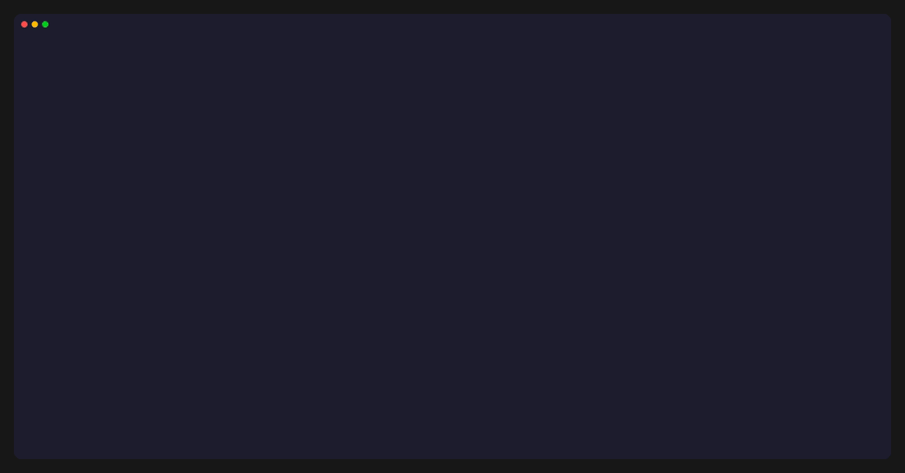
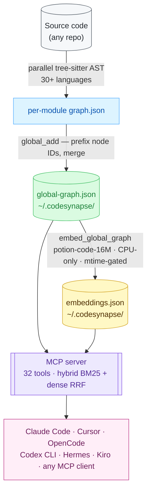

<div align="center">

<picture>
  <source media="(prefers-color-scheme: dark)"  srcset="assets/logo-dark.svg">
  <source media="(prefers-color-scheme: light)" srcset="assets/logo-light.svg">
  
</picture>

<br/>

**Code intelligence MCP server — gives AI coding assistants architecture-level knowledge of your codebase.**

[](https://github.com/sohilladhani/codesynapse/actions/workflows/ci.yml)
[](https://crates.io/crates/codesynapse-cli)
[](LICENSE)
[](https://www.rust-lang.org)

[Quick Start](#quick-start) · [MCP Tools](#mcp-tools) · [Languages](#language-support) · [Configuration](#configuration) · [Uninstall](#uninstall) · [Troubleshooting](#troubleshooting) · [Contributing](#contributing)

<br/>

<a href="https://www.producthunt.com/products/codesynapse?embed=true&utm_source=badge-featured&utm_medium=badge&utm_campaign=badge-codesynapse" target="_blank" rel="noopener noreferrer"></a>

</div>

---

AI coding tools answer questions about individual files well. They cannot reason about *architecture* — class hierarchies, call chains, blast radius of a change, which module owns a concept. `grep` and file search return noise, not signal.

Codesynapse fixes this. It builds a structural knowledge graph from your source code (nodes = classes, functions, files; edges = calls, extends, implements, contains), merges graphs from multiple modules into a single global graph, and exposes **32 MCP tools** backed by hybrid BM25 + dense vector search. Every session with Claude Code or Cursor starts with full graph context — not a blank slate.

Runs entirely local. No GPU, no cloud APIs, no infrastructure.

---

## Demo



<!-- To regenerate: install vhs (https://github.com/charmbracelet/vhs) then run: vhs assets/demo.tape -->

---

## Why codesynapse?

| | Python graphify | graphify-rs | semble | code-review-graph | codegraph | Sourcegraph Cody | continue.dev | **codesynapse** |
|---|---|---|---|---|---|---|---|---|
| **Language** | Python | Rust | Python | Python | TypeScript | Cloud | VS Code ext. | **Rust** |
| **MCP tools** | ✗ | ✗ | 2 | 30 | 10 | ✗ | ✗ | **32** |
| **Structural graph** | Partial | General KG | ✗ | ✓ | ✓ | ✓ | ✗ | **✓** |
| **Blast radius** | ✗ | ✗ | ✗ | ✓ | ✓ | ✓ | ✗ | **✓** |
| **Hybrid BM25 + dense** | ✗ | BM25 only | ✓ | Optional | ✗ (FTS5) | ✓ | ✗ | **✓** |
| **Fully local** | ✓ | ✓ | ✓ | ✓ | ✓ | ✗ | ✗ | **✓** |
| **No cloud API needed** | ✓ | ✓ | ✓ | ✗ (semantic) | ✓ | ✗ | ✗ | **✓** |
| **Multi-module graph** | ✗ | ✗ | ✗ | ✓ | ✓ | ✓ | ✗ | **✓** |
| **Cross-module hierarchy** | ✗ | ✗ | ✗ | ✗ | ✓ | ✓ | ✗ | **✓** |
| **File reads eliminated** | — | — | — | — | 100% | — | — | **100%** |
| **No telemetry by default** | ✓ | ✓ | ✓ | ✓ | ✗ (opt-out) | ✗ | ✗ | **✓ (opt-in)** |
| **Runtime** | Python | Rust | Python | Python | Node.js | Cloud | Node.js | **Rust binary** |

**codegraph** is the closest alternative — TypeScript, local, 10 MCP tools, blast radius, multi-module. Key gap: lexical FTS5 search only (no dense embeddings), so synonym and concept queries miss results that BM25+dense RRF catches. **semble** uses the same Model2Vec + BM25 + RRF search stack but is search-only — no structural graph, no blast radius, no hierarchy. **code-review-graph** has graph + MCP but is Python and requires a cloud API for semantic search. **graphify-rs** is the Rust rewrite of the original Python graphify tool — general-purpose knowledge graphs, not MCP-native or code-intelligence-focused.

Codesynapse is the Rust rewrite of [Python graphify](https://github.com/safishamsi/graphify) with full MCP integration, structural graph analysis, and zero cloud dependencies.

---

## How it works



**Key design choices:**

| Decision | Reason |
|---|---|
| Hybrid BM25 + dense RRF | BM25 handles symbol names precisely; dense closes the synonym gap. RRF fusion gives best of both. |
| Model2Vec `potion-code-16M` | Static embeddings — no forward pass at query time, ~1.5ms queries, CPU-only, 64 MB model. |
| Sled embedded DB | Zero-dependency, file-based, fast random access by node ID. No server process. |
| Tree-sitter AST extraction | Grammar coverage across 30+ languages. No language server or build system required. |
| Per-module → global merge | Enables cross-module blast radius and hierarchy without loading all modules into memory. |
| Mtime-gated embedding regen | Embeddings only regenerated when `global-graph.json` is newer. Zero overhead for unchanged graphs. |

---

## Language support

| Group | Languages |
|---|---|
| **Systems** | Rust, C, C++, Go, Zig, Fortran, Verilog |
| **JVM** | Java, Kotlin, Scala, Groovy |
| **Web / Frontend** | JavaScript, TypeScript, Svelte, Vue, PHP |
| **Scripting** | Python, Ruby, Lua, Bash, PowerShell |
| **Mobile / Apple** | Swift, Objective-C, Dart |
| **Functional** | Haskell, Elixir, Racket, Julia |
| **Other** | SQL, C#, CMake, Pascal |

---

## Installation

**Prerequisites:**
- ~500 MB free disk (graph store + model, downloaded on first `setup`)
- Internet connection on first run (model download only)

**Option A — One-liner**

Linux / macOS:
```bash
curl -fsSL https://raw.githubusercontent.com/sohilladhani/codesynapse/master/install.sh | sh
```

Windows (PowerShell):
```powershell
irm https://raw.githubusercontent.com/sohilladhani/codesynapse/master/install.ps1 | iex
```

Or download a specific binary from [releases](https://github.com/sohilladhani/codesynapse/releases/latest):

| Platform | Binary |
|---|---|
| Linux x86_64 | `codesynapse-linux-x86_64` |
| macOS Apple Silicon | `codesynapse-macos-aarch64` |
| Windows x86_64 | `codesynapse-windows-x86_64.exe` |

```bash
chmod +x codesynapse-*
sudo mv codesynapse-* /usr/local/bin/codesynapse
```

**Option B — Package managers**

macOS (Homebrew):
```bash
brew tap sohilladhani/codesynapse
brew install codesynapse
```

Windows (Scoop):
```powershell
scoop bucket add cs https://github.com/sohilladhani/scoop-codesynapse
scoop install codesynapse
```

Nix:
```bash
nix run github:sohilladhani/codesynapse        # run directly
nix profile install github:sohilladhani/codesynapse  # install permanently
```

Or add to your flake:
```nix
inputs.codesynapse.url = "github:sohilladhani/codesynapse";
# then: inputs.codesynapse.packages.${system}.default
```

**Option C — Build from source**

Requires Rust stable toolchain ([install](https://rustup.rs)):

```bash
cargo install codesynapse-cli
```

---

## Quick start

```bash
# 1. Register the MCP server with Claude Code and/or Cursor (auto-detects both)
codesynapse setup

# Other clients (if not auto-detected):
codesynapse opencode install  # OpenCode
codesynapse codex install     # Codex CLI
codesynapse hermes install    # Hermes Agent
codesynapse kiro install      # Kiro

# 2. Index a repository
codesynapse module add myrepo /path/to/your/repo

# 3. Restart your AI client

# 4. Ask architecture questions — the 32 MCP tools are now available
```

That's it. From this point, queries like *"what handles auth token expiry?"* or *"show blast radius of UserService"* are answered from the graph — not from file search.

**Add more repositories:**
```bash
codesynapse module add backend /path/to/backend
codesynapse module add frontend /path/to/frontend
# Graphs are merged — cross-module queries work automatically
```

**Refresh after code changes:**
```bash
codesynapse module refresh myrepo
```

**List indexed modules:**
```bash
codesynapse module list
```

**Remove a module:**
```bash
codesynapse module remove myrepo
# Prunes its nodes from the global graph and deregisters it
```

**Keep the graph current with git (optional):**
```bash
codesynapse hook install   # installs a post-merge git hook — auto-refreshes on pull
```

---

## MCP tools

32 tools across six categories, callable from Claude Code, Cursor, or any MCP-compatible client.

| Category | Tools |
|---|---|
| **Graph search** | `codesynapse_query_vector`, `codesynapse_query_semantic`, `codesynapse_blast_radius`, `codesynapse_blast_radius_scored`, `codesynapse_blast_radius_multi`, `codesynapse_hierarchy`, `codesynapse_list_graphs`, `codesynapse_module_summary`, `codesynapse_build` |
| **Code reading** | `codesynapse_resolve`, `codesynapse_outline`, `codesynapse_read`, `codesynapse_read_method`, `codesynapse_read_with_callees` |
| **Navigation** | `codesynapse_find_callers`, `codesynapse_find_usages` |
| **Graph analysis** | `codesynapse_query_graph`, `codesynapse_get_node`, `codesynapse_get_neighbors`, `codesynapse_get_community`, `codesynapse_god_nodes`, `codesynapse_graph_stats`, `codesynapse_shortest_path`, `codesynapse_find_all_paths`, `codesynapse_weighted_path`, `codesynapse_community_bridges`, `codesynapse_diff`, `codesynapse_pagerank`, `codesynapse_detect_cycles`, `codesynapse_smart_summary`, `codesynapse_find_similar` |
| **Observability** | `codesynapse_stats` |

Full parameter reference and examples: [docs/MCP-TOOLS.md](docs/MCP-TOOLS.md)

**Common queries in Claude Code:**
```
"What handles auth token expiry?"          → codesynapse_query_vector
"Show blast radius of UserService"         → codesynapse_blast_radius
"What does UserRepository extend?"         → codesynapse_hierarchy
"Read the validate() method"               → codesynapse_read_method
"Who calls PaymentService.charge()?"       → codesynapse_find_callers
```

---

## Configuration

Place `codesynapse.toml` in your project root. All fields are optional.

```toml
# Output directory for exported graph (default: codesynapse-out/)
output = "codesynapse-out"

# Skip LLM extraction for doc/paper files (default: false)
no_llm = false

# Index source code only, skip docs and papers (default: false)
code_only = false

# Export formats: "json", "html", "graphml", "obsidian"
formats = ["json", "html"]

# LLM config for semantic extraction of docs/papers (optional)
[llm]
provider = "anthropic"           # "anthropic" | "openai" | any OpenAI-compatible
model = "claude-sonnet-4-20250514"
api_key = "sk-..."               # or set ANTHROPIC_API_KEY / OPENAI_API_KEY env var
base_url = "https://..."         # optional, for OpenAI-compatible providers

# Custom model path (default: auto-resolved by codesynapse setup)
[embeddings]
model_path = "./models/potion-code-16M"
```

---

## Repository layout

```
codesynapse/
├── codesynapse-core/       # Extraction, graph, embedding, global graph
├── codesynapse-cli/        # CLI binary (module add/refresh/list, build, setup)
├── codesynapse-mcp/        # MCP server — 32 tools, JSON-RPC over stdio
├── codesynapse-serve/      # BM25 + dense hybrid search engine
├── codesynapse-tui/        # Terminal UI
├── codesynapse-grpc/       # gRPC server
├── codesynapse-graphql/    # GraphQL API
├── codesynapse-wasm/       # WebAssembly bindings
├── models/
│   └── potion-code-16M/    # Static embedding model (downloaded by setup)
├── tests/                  # Integration tests
└── docs/
    ├── ARCHITECTURE.md
    └── MCP-TOOLS.md
```

Runtime data lives in `~/.codesynapse/`:
```
~/.codesynapse/
├── global-graph.json       # Merged graph (all modules)
├── embeddings.json         # node_id → Vec<f32> dense embeddings
├── modules.conf            # name|/path module registry
├── global-manifest.json    # Per-module hash + metadata
├── tool_stats.jsonl        # MCP tool call log
├── models/potion-code-16M/
└── modules/<name>/graph.json
```

---

## Uninstall

**Remove from all AI clients:**
```bash
# Re-run setup and remove the entry manually from the config files setup wrote:
#   Claude Code:  ~/.claude.json       (key: mcpServers.codesynapse)
#   Cursor:       ~/.cursor/mcp.json   (key: mcpServers.codesynapse)
#   Windsurf:     ~/.codeium/windsurf/mcp_config.json
#   OpenCode:     ~/.config/opencode/opencode.json
```

**Remove a specific module:**
```bash
codesynapse module remove myrepo
```

**Full cleanup** (removes all indexed data):
```bash
rm -rf ~/.codesynapse/
```

---

## Manual MCP setup

If `codesynapse setup` doesn't auto-detect your client, add this entry manually:

**Claude Code** (`~/.claude.json`):
```json
{
  "mcpServers": {
    "codesynapse": {
      "type": "stdio",
      "command": "codesynapse",
      "args": ["mcp"]
    }
  }
}
```

**Cursor** (`~/.cursor/mcp.json`):
```json
{
  "mcpServers": {
    "codesynapse": {
      "type": "stdio",
      "command": "codesynapse",
      "args": ["mcp"]
    }
  }
}
```

For other clients, pass the same `command`/`args` pair to their MCP server config.

---

## CLI skill (MCP-free fallback)

If MCP is blocked by your org's network policy, codesynapse ships a CLI skill for Claude Code and a rules file for Cursor. Your AI client shells out to `codesynapse` directly instead of using the MCP protocol.

**Claude Code** — copy into your project:
```bash
mkdir -p /path/to/your/project/.claude/skills
cp -r integrations/claude-code/skills/codesynapse-cli /path/to/your/project/.claude/skills/
```

**Cursor** — copy into your project:
```bash
mkdir -p /path/to/your/project/.cursor/rules
cp integrations/cursor/rules/codesynapse-cli.mdc /path/to/your/project/.cursor/rules/
```

The `integrations/` directory ships with the repository. Restart your client after copying.

---

## pi extension

For [pi](https://github.com/pi-ai/pi) users, install the codesynapse extension:

```bash
pi install npm:codesynapse-pi
```

This wires up 12 curated codesynapse tools and injects graph-awareness into every pi session automatically.

---

## Troubleshooting

**MCP server not connecting**
- Verify `codesynapse` is on your PATH: `which codesynapse`
- Run `codesynapse setup` again — it re-writes the client config
- Restart your AI client after setup

**No results from graph queries**
- Check modules are indexed: `codesynapse module list`
- Rebuild the global graph: `codesynapse build`
- Ensure the model downloaded: `codesynapse setup` (downloads `potion-code-16M` on first run)

**Stale results after code changes**
- Refresh the module: `codesynapse module refresh myrepo`
- Or install the git hook for automatic refresh: `codesynapse hook install`

**`codesynapse setup` says no embedding model**

`codesynapse setup` downloads the model automatically. If it fails:

1. Check your internet connection and re-run `codesynapse setup`
2. Download manually from HuggingFace:
   ```
   https://huggingface.co/minishlab/potion-code-16M/resolve/main/model.safetensors
   https://huggingface.co/minishlab/potion-code-16M/resolve/main/tokenizer.json
   https://huggingface.co/minishlab/potion-code-16M/resolve/main/config.json
   ```
   Place all three files in `~/.codesynapse/models/potion-code-16M/`, then re-run `codesynapse setup`.

**Graph query is slow**
- First query after startup is slower — embeddings load from disk
- Subsequent queries are fast (~1.5 ms encode + BM25 + cosine)

---

## Telemetry

Telemetry is **off by default**. Enable it explicitly if you want to help improve codesynapse:

```bash
codesynapse telemetry on    # opt in
codesynapse telemetry off   # opt out + delete local queue
```

When enabled, codesynapse sends anonymous daily rollups: tool names, call counts, and coarse token-savings buckets. No query content, no file paths, no source code, no IPs. See [TELEMETRY.md](TELEMETRY.md) for the full data contract.

---

## Contributing

Contributions welcome. Please read [CONTRIBUTING.md](CONTRIBUTING.md) before opening a PR.

- **Bug reports:** use the [bug report template](.github/ISSUE_TEMPLATE/bug_report.md)
- **Feature requests:** use the [feature request template](.github/ISSUE_TEMPLATE/feature_request.md)
- **Code:** run `cargo test --workspace` and `cargo clippy --workspace -- -D warnings` before submitting

This project follows the [Contributor Covenant](CODE_OF_CONDUCT.md) code of conduct.

---

## License

MIT — see [LICENSE](LICENSE).
