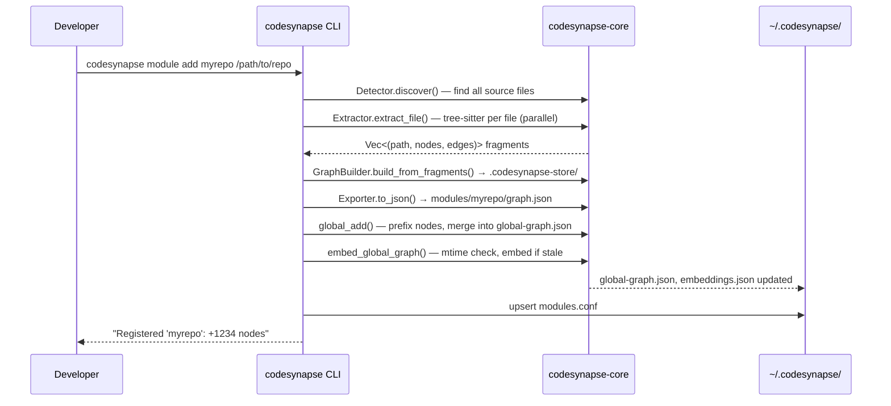
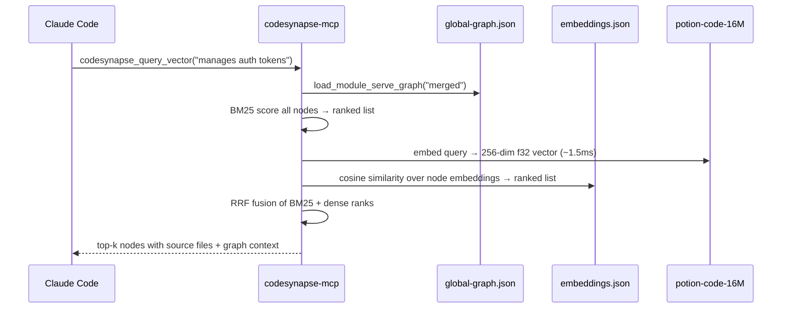
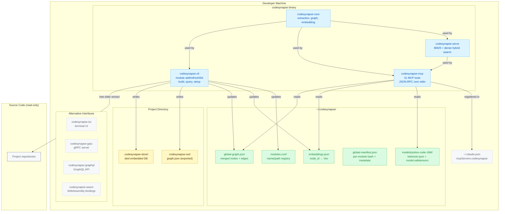
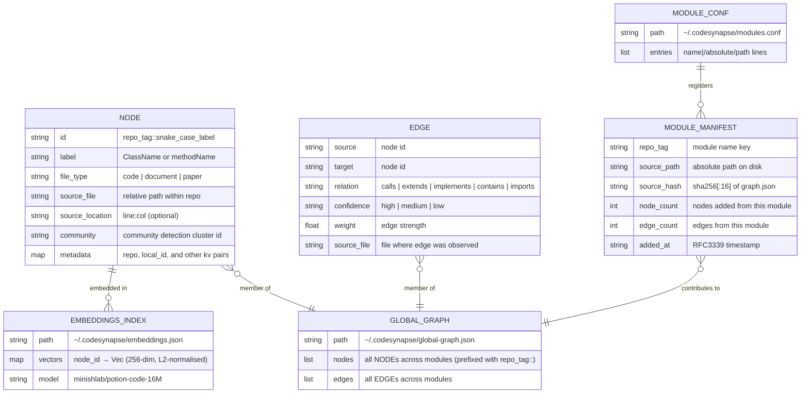
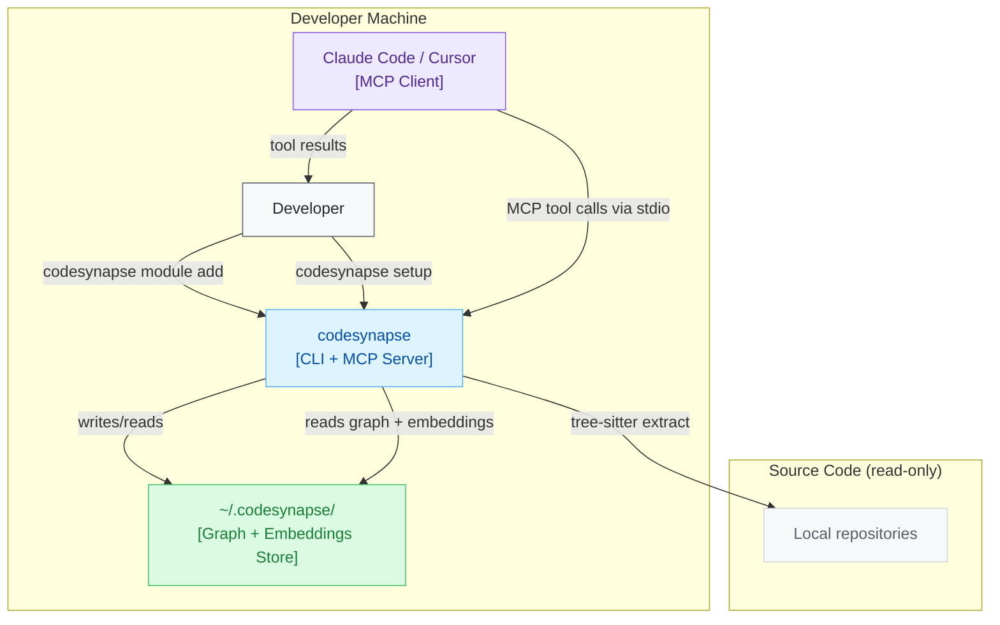

# Codesynapse — Code Intelligence MCP Server

---

## Abstract

Codesynapse is a code intelligence MCP server — it builds a queryable knowledge graph from your source code and exposes it to AI coding assistants. Engineers working in large codebases face a recurring problem: AI coding tools answer questions about individual files well, but cannot reason about architecture-level structure — class hierarchies, call chains, blast radius of a change, or which module owns a concept. `grep` and file search return noise, not signal.

Codesynapse addresses this by extracting a structural knowledge graph (nodes = classes, functions, files; edges = calls, extends, implements, contains) from source code using tree-sitter AST extraction, merging graphs from multiple modules into a single global graph, and exposing 32 MCP tools backed by hybrid BM25+dense vector search. Every session with Claude Code or any MCP-compatible client starts with full graph context — not a blank slate.

---

## Overview

### What Codesynapse Does

```
Source code → tree-sitter extraction → per-module graph.json
                                     ↓
                         global-graph.json (merged)
                                     ↓
                   embeddings.json (potion-code-16M, CPU-only)
                                     ↓
                      MCP server (32 tools, hybrid search)
                                     ↓
                     Claude Code / Cursor / any MCP client
```

### Design Goals

| Goal | Measure |
|------|---------|
| Architecture-aware AI queries | `codesynapse_query_vector` returns semantically relevant classes in <5s |
| Zero infrastructure dependency | Runs entirely local; no APIs, no GPU, no cloud services required |
| Multi-language support | Java, Python, JS/TS, Go, Rust, C/C++, C#, Kotlin, Swift, PHP, Ruby, and more |
| MCP-native tool interface | All 32 tools callable from Claude Code, Cursor, or any MCP client |
| Low friction adoption | One command: `codesynapse module add <name> <path>` + `codesynapse setup` |
| Incremental re-indexing | Per-file hash caching; only changed files re-extracted on refresh |

### Out of Scope

- **External API for embeddings** — dense embeddings use bundled local model (`potion-code-16M`); no API calls
- **Real-time file watching** — graphs refreshed on-demand via `module refresh`, not continuously
- **Session memory** — persistent conversation memory across sessions
- **Multi-user shared graphs** — each developer runs their own global graph; no team graph sharing
- **Visual IDE plugin** — MCP protocol only; no GUI

### Key Decisions

| Decision | Rationale |
|----------|-----------|
| Hybrid BM25 + dense RRF search | BM25 handles symbol names precisely; dense embeddings close the synonym/paraphrase gap. RRF fusion gives best of both. |
| Model2Vec (`potion-code-16M`) | Static embeddings — no forward pass at query time, ~1.5ms queries, CPU-only, 64 MB model |
| Sled embedded DB as graph store | Zero-dependency, file-based, fast random access by node ID; no server process required |
| Tree-sitter for AST extraction | Grammar coverage across 20+ languages; no language server or build system required |
| Per-module graphs merged into global | Enables cross-module blast radius and hierarchy queries without loading all modules into memory |
| Mtime-gated embedding regeneration | Embeddings only regenerated when `global-graph.json` is newer; zero overhead for unchanged graphs |

---

## Conceptual Design

### Data Flow: Module Add



### Data Flow: MCP Tool Call



### Component Model



### Logical Data Model



---

## Architecture

### System Diagram



### Crate Dependency Map

```
codesynapse-cli
  └── codesynapse-core      (extraction, graph, embedding, global graph)

codesynapse-mcp
  ├── codesynapse-core
  └── codesynapse-serve     (BM25 + dense hybrid search engine)

codesynapse-tui
  └── codesynapse-core

codesynapse-grpc
  └── codesynapse-core

codesynapse-graphql
  └── codesynapse-core

codesynapse-wasm
  └── codesynapse-core
```

### Key Flows

#### Flow 1: `module add` (initial index)

1. `Detector` discovers all files — classifies as `code`, `document`, or `paper` by extension
2. `Extractor` runs tree-sitter grammar per file in parallel (`rayon`) — yields `(path, nodes, edges)` tuples
3. If `--llm` set, `LlmExtractor` processes document/paper files via LLM API — fragments merged before build
4. `GraphBuilder.build_from_fragments()` writes nodes + edges to local `.codesynapse-store/` (sled)
5. `Exporter.to_json()` writes `modules/<name>/graph.json`
6. `global_add()` prefixes all node IDs with `repo_tag::`, prunes old version, merges into `global-graph.json`
7. `embed_global_graph()` checks mtime — regenerates `embeddings.json` only if graph is newer than embeddings
8. `modules.conf` updated with `name|/path` entry

#### Flow 2: MCP tool call (`codesynapse_query_vector`)

1. MCP server loaded `StaticEmbedder` and `node_embeddings` at startup from `~/.codesynapse/`
2. Query text embedded via Model2Vec tokenizer → mean-pooled → L2-normalised 256-dim vector
3. BM25 index built over node labels + source files → top candidates ranked
4. Cosine similarity over `node_embeddings` → dense ranked list
5. RRF fusion merges BM25 + dense ranks
6. BFS traversal expands top candidates to include structural neighbours
7. Result truncated to `top_k * 200` token budget, returned as formatted text

#### Flow 3: `codesynapse_blast_radius("ClassName")`

1. Find node by label in global graph (exact + fuzzy match)
2. BFS outward on `calls` / `imports` / `contains` edges up to depth 2
3. BFS inward on reverse edges (who calls/imports this class)
4. Deduplicate, format as tree: direct callers → transitive callers

### MCP Tools (32 total)

| Category | Tools |
|----------|-------|
| **Graph search** | `codesynapse_query_vector`, `codesynapse_query_semantic`, `codesynapse_blast_radius`, `codesynapse_blast_radius_scored`, `codesynapse_blast_radius_multi`, `codesynapse_hierarchy`, `codesynapse_list_graphs`, `codesynapse_module_summary`, `codesynapse_build` |
| **Code reading** | `codesynapse_resolve`, `codesynapse_outline`, `codesynapse_read`, `codesynapse_read_method`, `codesynapse_read_with_callees` |
| **Navigation** | `codesynapse_find_callers`, `codesynapse_find_usages` |
| **Graph analysis** | `codesynapse_query_graph`, `codesynapse_get_node`, `codesynapse_get_neighbors`, `codesynapse_get_community`, `codesynapse_god_nodes`, `codesynapse_graph_stats`, `codesynapse_shortest_path`, `codesynapse_find_all_paths`, `codesynapse_weighted_path`, `codesynapse_community_bridges`, `codesynapse_diff`, `codesynapse_pagerank`, `codesynapse_detect_cycles`, `codesynapse_smart_summary`, `codesynapse_find_similar` |
| **Observability** | `codesynapse_stats` |

---

## Non-Functional Requirements

| Attribute | Requirement | Notes |
|-----------|-------------|-------|
| **Query latency** | `codesynapse_query_vector` < 5s for graphs up to 50k nodes | BM25 is O(n); dense cosine O(n × dim). Model2Vec ~1.5ms encode. |
| **Extraction throughput** | > 1000 files/min on modern hardware | Rayon parallel extraction; per-file hash cache for incremental builds |
| **Embedding latency** | `embed_global_graph` < 60s for 20k nodes | CPU-only, static embeddings, no forward pass |
| **Memory footprint** | MCP server < 512 MB RAM | Global graph + embeddings loaded at startup; graph re-read on mtime change |
| **Disk footprint** | `global-graph.json` < 512 MB | Hard limit enforced; error returned if exceeded |
| **Cold start** | MCP server ready < 5s | Sled open + embeddings load from disk |
| **Language coverage** | 20+ languages | Java, Python, JS, TS, Go, Rust, C, C++, C#, Kotlin, Swift, PHP, Ruby, SQL, Bash, Scala, Dart, Lua, Zig, Haskell, Groovy |

---

## File Layout

```
~/.codesynapse/
  global-graph.json         ← merged graph (all modules)
  global-manifest.json      ← per-module hash + metadata registry
  modules.conf              ← name|/path module list
  embeddings.json           ← node_id → Vec<f32> dense embeddings
  tool_stats.jsonl          ← MCP tool call log (token savings)
  models/
    potion-code-16M/        ← tokenizer.json + model.safetensors
  modules/
    <name>/
      graph.json            ← per-module exported graph

<project>/
  .codesynapse-store/       ← sled embedded graph DB (gitignored)
  codesynapse-out/
    graph.json              ← human-readable exported graph
  codesynapse.toml          ← optional project config (output dir, LLM, formats)
```

