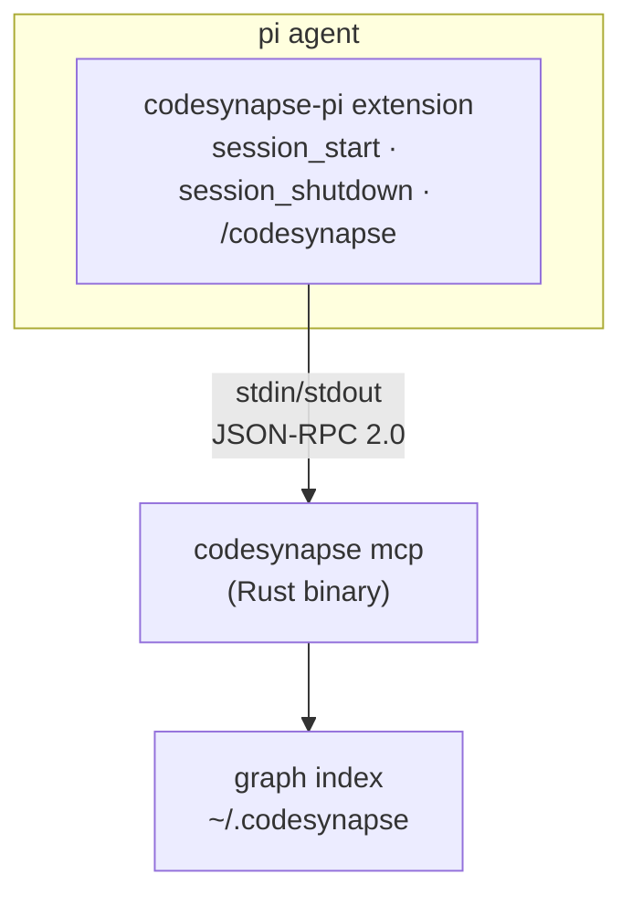

# codesynapse-pi

Pi coding agent extension that brings [codesynapse](https://github.com/sohil/codesynapse) code intelligence into pi.

## Architecture



## Install

```bash
# From npm (once published)
pi install npm:codesynapse-pi

# From source
cd pi/
npm install
npm run build
pi -e ./dist/extension.js
```

## Tools (12 curated)

| Tool | Purpose |
|------|---------|
| `codesynapse_context` | **PRIMARY** — search + call graph + source bodies (call this FIRST) |
| `codesynapse_resolve` | BM25+dense hybrid search fallback |
| `codesynapse_stats` | Session dashboard, token savings |
| `codesynapse_blast_radius` | Find everything affected by a change |
| `codesynapse_hierarchy` | Class inheritance tree |
| `codesynapse_list_graphs` | List all available modules |
| `codesynapse_module_summary` | Module overview (nodes, edges, god-nodes) |
| `codesynapse_outline` | Compact class structure (methods, fields, line numbers) |
| `codesynapse_read_method` | Get exact method body via brace tracking |
| `codesynapse_find_callers` | Who calls a symbol |
| `codesynapse_find_usages` | All files referencing a class |
| `codesynapse_build` | Reload graph after module changes |

## Commands

- **`/codesynapse`** — Check MCP connectivity and graph status

## System Prompt

When `codesynapse` is detected in PATH, the extension injects guidance telling the LLM to use `codesynapse_context(query)` as the PRIMARY tool for architecture/mechanism questions.

## Lifecycle

- **session_start**: Lazy-init MCP process (spawned on first tool call)
- **session_shutdown**: SIGTERM → 2s wait → SIGKILL the MCP subprocess

## Development

```bash
# Install dependencies
npm install

# Build
npm run build

# Run unit tests (no MCP binary needed)
npx tsx --test evals/extension.test.ts

# Run integration tests (requires codesynapse in PATH)
npx tsx --test evals/mcp-integration.test.ts

# Run all tests
npx tsx --test evals/*.test.ts
```
